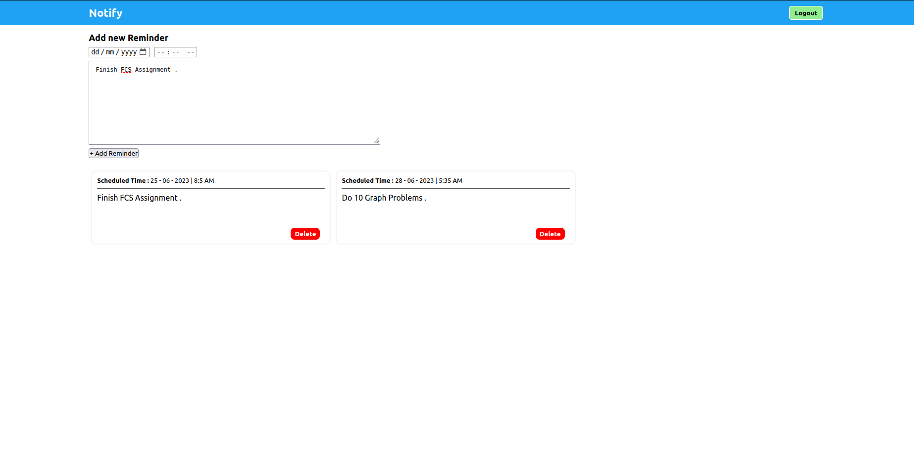

# Notify

A website that sends reminders over email . It is created using ReactJS , NodeJS , MongoDB . Also , setup message queues (Rabbit MQ) between the microservices .

## Installation

1) Clone the repository 
2) Run `cd Reminder-App` .
3) It contains frontend and backend folders . Go inside frontend and run `npm i` followed by `npm start`.
4) In the backend folder , it contains two folders , EmailService and ReminderService which are the two microservices created in the project .
5) Inside each of these folders , run `npm i` followed by `npm start` .

## Screenshots

